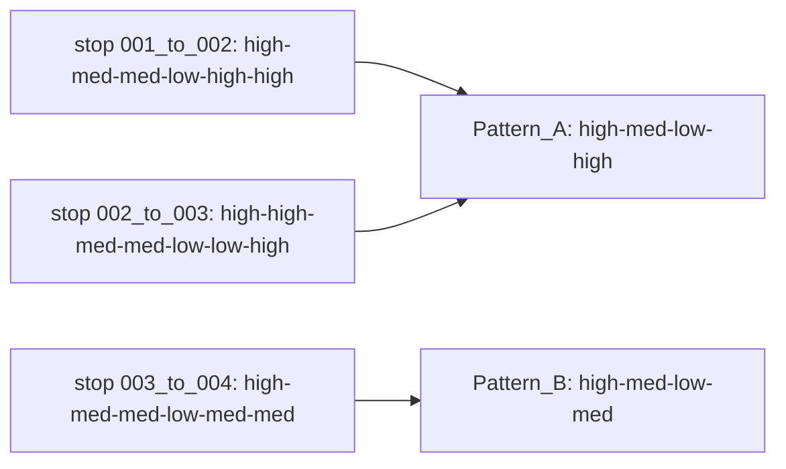

# Bus Pattern Analysis

The Delaware Valley Regional Planning Commission (DVRPC) partnered with the City of Philadelphia’s Office of Transportation and Infrastructure Systems (OTIS) to create a guide to identify and diagnose sources of bus delay on a roadway segment or corridor and recommend a design intervention to remedy the delay. This guide is designed to be used by OTIS's internal and external partners.<br><br>
Part 2, step 4 of the guide, instructs highlighting abnormal speed patterns. This repository includes the code and instructions for this step.

### Speed patterns definition (in this context)

Speed patterns refer to code-based simplified/abstracted reading of the AVL data available in Swift.ly and are calculated separately for each predefined time-interval. 
The high-resolution AVL data is provided in segments that are the same in length so that between each two stops on a route, the overall number of segments **can differ**. Each segment includes a numeric median speed value. Using Swift.ly-based speed buckets, the code first translates these buckets into text form. Then, it simplified each between-stop overall path into a pattern **regardless of the count of segments**.<br><br>Here is a (simplified) example:



> [!NOTE]  
> The current speed thresholds in the code are taken from Swift.ly definitions. To modify the thresholds or the overall amount of buckets, edit *part 1* R code, lines 18-25 *add_speed_med_def* function.

### What are abnormal speed patterns?

MISSING TEXT

## Installation/Setup

- Clone the repository
- Download and install R from https://www.r-project.org/
- Download and install R Studio from https://www.rstudio.com/products/rstudio/#Desktop
- Open the code files directly in R studio. If needed, push commits through GitHub desktop.
- Create the *.Renviron* files <br>
  The *.Renviron* file includes these two secret paths in this format:
  ```cmd
  import_folder="path/to/import_folder/with_files"
  export_folder="path/to/export_folder"
  ```
  The .Renviron file can be created in R studio through Files -> New Files -> Text File (and set up the .Renviron as type when saving.) <br>Alternatively, download the *.Renviron.Example* file to the folder from the repository, edit the secrets, and rename the file to *.Renviron*.<br>

  The beginning of each code file calls on the Renviron within its folder, then calls the relevant secrets:
  ```cmd
  readRenviron(paste0(dirname(rstudioapi::getActiveDocumentContext()$path), "/.Renviron"))
  import_folder <- Sys.getenv("import_folder")
  export_folder <- Sys.getenv("export_folder")
  ```
  
- Install all libraries before running them for the first time:
  ```cmd
  install.packages("name_of_package")
  library(name_of_package)
  ```
### Dependencies

These two code files utilize these three R packages:
- **dplyr**
- **sf**
- **tidyverse**

## Usage

1. Set up (create) the import and export folders for each specific bus route and direction reviewed<br><br>
2. Populate the import folder with these files:<br><br>
   - **Five CSV files**
     * Download five CSV files (per direction, per route) from the Swift.ly speed map page. Each file should align with the preferred time-intervals buckets. This step requires an active Swift.ly         user. For further instructions regarding manual Swift.ly downloads and/or time intervals, please review Appendix 1 of the full how-to guide.<br>
     * Name the files early_am, am_rush, midday, pm_rush & evening.<br><br>
   - **Septa routes points shapefile**<br>
     Can be downloaded from the DVRPC data catalog at: https://catalog.dvrpc.org/dataset/septa-transit-stops <br><br>
4. Follow the setup steps above, including cloning the repository and creating the .Renviron file.<br><br>
5. Run ‘part 1’ R code:<br><br>
   - Open *part1_patterns_time_matrix_and_dict.r* from the cloned repository directly in Rstudio
   - Run the code
   - Expected output to export folder: pattern_time_matrix.csv, pattern_dictionary.csv<br><br>
6. Manually flag abnormal patterns in the exported pattern dictionary CSV file.<br>Write 'T' under the *flagged_pattern* column to flag a pattern, then save the file. Flagging is to be carried by the planning/reviewing team's discretion. See the overall how-to guide by DVRPC's OTBP team for recommendations and a detailed explanation.<br><br>
7. Run ‘part 2’ R code:<br>
   - Open *part2_routes_and_matrix.r* from the cloned repository directly in Rstudio
   - Run the code
   - Expected output to export folder: matrix_mapped.shp, flagged_matrix.csv

> [!NOTE]  
> If a segment had missing (NA) values for at least one of the five time-intervals buckets, it will be dropped and will not appear in either of the outputted files

## Reviewing pattern analysis output

### matrix_mapped.shp

The second code produces a shapefile that allows mapping the abnormal pattern results. To do so, open the file using GIS software, such as ArcGIS Pro. In ArcGIS Pro, you can then add a definition query to the layer to present only the abnormal segments (all or from a specific time of day; modify the statement as needed). It is useful to add SEPTA's stop points shapefile to this map to see (and possibly label) the specific route's stops. This map can be used to select points for direct observations for the corridor study. <br><br>


### flagged_matrix.csv
In addition to the shapefile, you can review the flagged chart without GIS software using this file.

| stops_id | early_am | am_rush | midday | pm_rush | evening | early_am_t | am_rush_t | midday_t | pm_rush_t | evening_t |
| --- | --- | --- | --- | --- | --- | --- | --- | --- | --- | --- |
| 001_to_002 | pattern | pattern | pattern | pattern | pattern | FALSE | TRUE | TRUE | FALSE | FALSE |

Columns two to six of the output table provide the speed pattern of a specific segment throughout the day. The last five columns indicate if the team flagged one or more of the time intervals as abnormal. 
The file allows for filtering abnormal segments and conditional formatting of results if needed.


